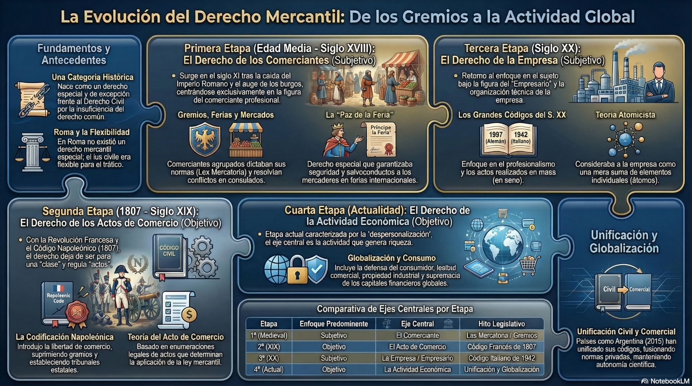
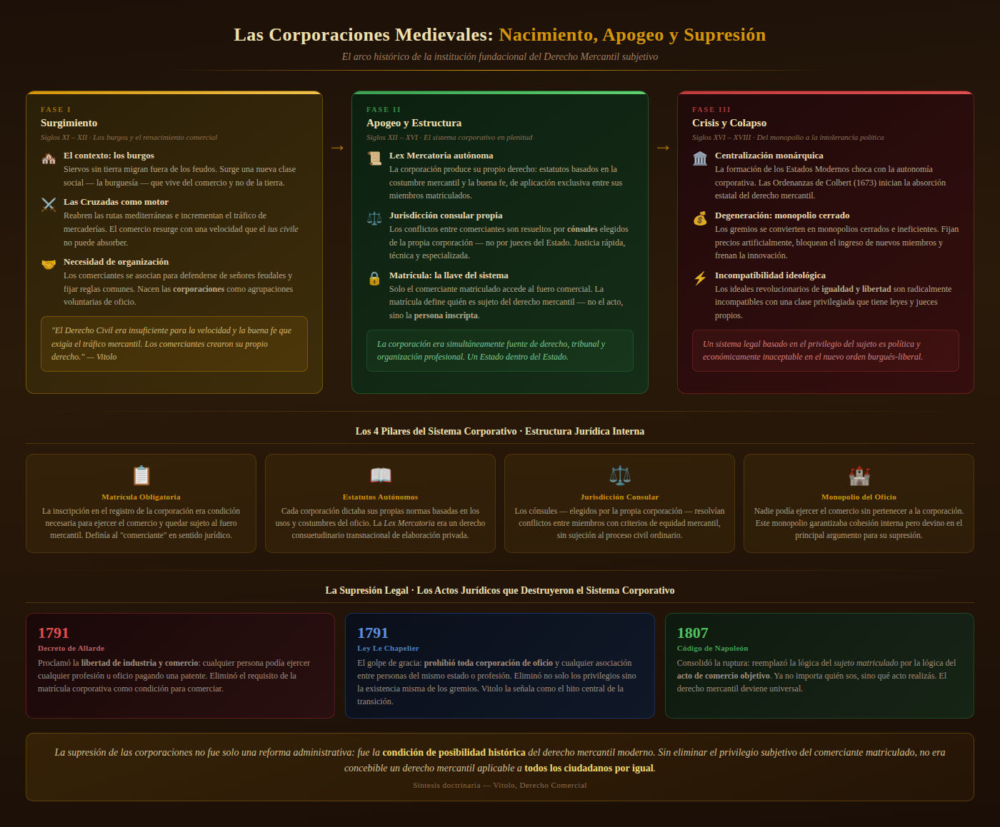

# Derecho Comercial I

## Clase 1

### Evolución y configuración actual del Derecho Comercial

Universidad Nacional de Moreno

---

# Una pregunta para empezar

## Si el Código de Comercio fue derogado...

### ¿por qué seguimos estudiando Derecho Comercial?

---

# Durante mucho tiempo era fácil identificarlo

Existía un:

- **Código de Comercio**
- **comerciante**
- **acto de comercio**
- régimen de **obligaciones comerciales**

---

# Hoy el panorama es distinto

## El Código desapareció

## El Derecho Comercial, no.

---

# El problema de esta clase

Vamos a intentar responder tres preguntas:

1. ¿Por qué apareció históricamente un Derecho Comercial?
2. ¿Por qué fue cambiando?
3. ¿Qué identifica hoy a esta rama del Derecho?

---

# Una disciplina histórica

El Derecho Comercial no puede comprenderse al margen de la evolución de la actividad económica.

## Cambia la economía

### cambia la organización jurídica del comercio

---

# Una primera aproximación actual

## El Derecho Comercial regula

::: {.columns}

::: {.column width="33%"}
### EMPRESAS

Organización de la actividad económica.
:::

::: {.column width="33%"}
### NEGOCIOS

Instrumentos jurídicos del intercambio.
:::

::: {.column width="33%"}
### MERCADO

Espacio de interacción y regulación.
:::

:::

**Favier Dubois, Manual de Derecho Comercial, cap. 1.**

---

# Empresa

La empresa aparece como una **organización** destinada al desarrollo de actividades de producción o intercambio de bienes y servicios.

Su regulación comprende, entre otros aspectos:

- organización
- representación
- contabilidad
- registración
- responsabilidad
- insolvencia

---

# Negocios

Los negocios permiten jurídicamente:

- intercambiar bienes y servicios
- financiar actividades
- movilizar el crédito
- distribuir riesgos
- organizar relaciones económicas

---

# Mercado

El mercado tampoco funciona al margen del Derecho.

El ordenamiento establece reglas sobre:

- competencia
- consumidores
- inversores
- entidades financieras
- seguros
- sociedades sujetas a control

---

# Una idea central

## El Derecho Comercial cumple dos funciones

::: {.columns}

::: {.column width="48%"}
### Facilitar

- negocios
- crédito
- circulación de riqueza
- financiamiento
- organización empresaria
:::

::: {.column width="48%"}
### Limitar

- abusos
- asimetrías
- riesgos
- poder económico
- daños a terceros
:::

:::

**Favier Dubois, Manual de Derecho Comercial, cap. 1.**

---

# Función facilitadora

La actividad económica necesita:

- rapidez
- simplicidad
- seguridad
- previsibilidad
- crédito
- circulación

## El Derecho crea instrumentos para hacer posibles los negocios.

---

# Función limitante

Pero facilitar la actividad económica no significa permitir cualquier conducta.

El Derecho también impone:

- contabilidad
- publicidad
- registración
- transparencia
- rendición de cuentas
- controles
- responsabilidad

---

# Una tensión permanente

::: {.columns}

::: {.column width="48%"}
## Libertad

para desarrollar actividades económicas
:::

::: {.column width="48%"}
## Regulación

para proteger intereses jurídicamente relevantes
:::

:::

# Para entender el presente...

## tenemos que mirar hacia atrás

# Mapa de la evolución del Derecho Comercial

{width=95%}

---

# Tres grandes etapas

## 1. Comerciante

## 2. Acto de comercio

## 3. Empresa

---

# Recorrido interactivo: etapas del Derecho Comercial

## Material complementario

[**Abrir Genially · Etapas del Derecho Comercial**](https://view.genially.com/65f1379d67c132001479c8af)

El recurso repasa visualmente:

- etapa subjetiva y comerciante
- corporaciones, ferias y mercados
- *lex mercatoria*
- paso al acto de comercio
- Código de Napoleón de 1807
- empresa y actividad económica organizada

### Lo usamos como mapa visual antes de entrar en cada etapa.

---

# Primera etapa

## EL COMERCIANTE

### Concepción subjetiva del Derecho Comercial

---

# El origen

El Derecho Comercial surge históricamente vinculado a quienes ejercían profesionalmente el comercio.

No era un derecho general.

Era un derecho:

- profesional
- especial
- ligado a una determinada categoría de sujetos

**Vítolo, Manual de Derecho Comercial, cap. I.**

---

# ¿Por qué aparece?

La actividad mercantil tenía necesidades particulares:

- rapidez
- crédito
- seguridad
- uniformidad
- solución ágil de conflictos

---

# El contexto medieval

Con el desarrollo del comercio adquieren especial importancia:

- las ciudades
- los mercados
- las ferias

---

# Ferias y mercados

En las ferias se encontraban comerciantes provenientes de distintos territorios.

Cada uno podía estar sometido a:

- autoridades diferentes
- reglas diferentes
- tradiciones jurídicas diferentes

## El comercio necesitaba reglas comunes.

---

# Usos y costumbres

Las prácticas reiteradas de los comerciantes fueron generando reglas propias.

Esas reglas respondían directamente a las necesidades del tráfico.

### El Derecho Mercantil nace fuertemente vinculado a la costumbre.

---

# Corporaciones

Los comerciantes comenzaron a organizarse en corporaciones profesionales.

Estas organizaciones:

- disciplinaban la actividad
- establecían reglas
- protegían intereses comunes
- resolvían controversias

---

# Jurisdicción mercantil

Los conflictos entre comerciantes podían ser resueltos por órganos vinculados a las propias corporaciones.

Esto permitía:

- procedimientos más simples
- decisiones más rápidas
- aplicación de usos comerciales

---

# La primera lógica del sistema

## La pregunta era:

### ¿QUIÉN REALIZA LA ACTIVIDAD?

Si era comerciante, resultaba aplicable el Derecho Mercantil.

---

# Concepción subjetiva

El centro del sistema era:

## el sujeto comerciante

Por eso se habla de una concepción **subjetiva** del Derecho Comercial.

---

# Un Derecho profesional

El Derecho Mercantil podía concebirse como:

> un derecho especial aplicable a quienes ejercían profesionalmente el comercio.

**Vítolo, Manual de Derecho Comercial, cap. I.**

---

# Pero aparece un problema

¿Qué ocurre cuando interviene una persona que no pertenece a la categoría de comerciante?

Por ejemplo:

## un comerciante celebra un negocio con alguien que no lo es

# Las corporaciones medievales

{width=96%}

# El contexto cambia

Entre los siglos XVIII y XIX aparecen nuevas ideas políticas y jurídicas.

La Revolución Francesa cuestiona:

- privilegios corporativos
- diferencias jurídicas de clase
- restricciones al ejercicio de actividades

---

# Nuevos principios

## Igualdad

## Libertad

## Libre acceso a la actividad económica

La condición profesional deja de ser suficiente para delimitar un derecho especial.

---

# Segunda etapa

## EL ACTO DE COMERCIO

### Concepción objetiva

---

# Cambia la pregunta

Antes:

## ¿QUIÉN realiza la actividad?

Ahora:

## ¿QUÉ ACTO se realiza?

---

# El nuevo criterio

Determinados actos pasan a ser considerados comerciales.

La aplicación del Derecho Comercial comienza a depender de la **naturaleza del acto**.

---

# El centro se desplaza

::: {.columns}

::: {.column width="48%"}
## Antes

Comerciante
:::

::: {.column width="48%"}
## Ahora

Acto de comercio
:::

:::

---

# Código de Comercio francés

El Código francés de 1807 constituye un momento decisivo.

La materia mercantil comienza a estructurarse alrededor de los:

## actos de comercio

**Vítolo, Manual de Derecho Comercial, cap. I.**

---

# Una consecuencia importante

Una persona podía quedar alcanzada por reglas comerciales:

## aunque no fuera comerciante

si realizaba determinados actos considerados comerciales.

---

# Dos modelos

| Concepción subjetiva | Concepción objetiva |
|---|---|
| Comerciante | Acto de comercio |
| Importa el sujeto | Importa el acto |
| Derecho profesional | Derecho de determinados actos |

---

# Una pregunta

Una persona compra mercadería habitualmente para revenderla.

Otra vende por única vez un mueble de su casa.

## ¿Son jurídicamente equivalentes?

---

# La expansión del modelo

La concepción objetiva tuvo enorme influencia durante el siglo XIX.

También influyó decisivamente en:

## el Derecho Comercial argentino

---

# Argentina

## Código de Comercio

Durante gran parte de nuestra historia coexistieron:

### Código Civil

y

### Código de Comercio

---

# Dos grandes campos

La existencia de dos códigos obligaba a determinar:

## ¿la relación era civil o comercial?

La respuesta podía modificar el régimen aplicable.

---

# El acto de comercio como frontera

El sistema necesitaba un criterio para distinguir ambas esferas.

El **acto de comercio** cumplía esa función delimitadora.

---

# Pero la economía volvió a cambiar

Durante los siglos XIX y XX aparece una transformación decisiva:

## la industrialización

---

# Del acto aislado...

El acto de comercio observa fundamentalmente:

## una operación

Pero la economía moderna muestra algo diferente:

## una actividad organizada y continuada

---

# Aparece otro protagonista

## LA EMPRESA

---

# Tercera etapa

## LA EMPRESA

### Actividad económica organizada

---

# ¿Qué cambia?

Ya no interesa solamente observar actos aislados.

Comienza a resultar relevante:

- reiteración
- coordinación
- organización
- finalidad económica

---

# Acto y actividad

::: {.columns}

::: {.column width="48%"}
## ACTO

Operación individual.
:::

::: {.column width="48%"}
## ACTIVIDAD

Conjunto organizado y continuado de actos.
:::

:::

---

# Organización

La empresa combina distintos elementos:

- capital
- trabajo
- bienes
- conocimiento
- tecnología
- organización

---

# El desplazamiento histórico

## COMERCIANTE

¿Quién actúa?

↓

## ACTO DE COMERCIO

¿Qué acto realiza?

↓

## EMPRESA

¿Qué actividad económica organizada desarrolla?

---

# La empresa como nuevo centro

Vítolo identifica a la empresa como elemento central de la concepción moderna del Derecho Comercial.

La transformación económica obliga a superar una visión construida exclusivamente sobre actos aislados.

**Vítolo, Manual de Derecho Comercial, cap. I.**

---

# Una advertencia importante

## Empresa no es sinónimo de sociedad

Una persona humana puede organizar una empresa.

Una sociedad es una estructura jurídica que puede utilizarse para desarrollar una actividad empresarial.

---

# Volvamos a Argentina

Durante el siglo XX, la realidad comercial fue progresivamente desbordando al Código de Comercio.

Muchas instituciones comenzaron a regularse mediante:

## leyes especiales

---

# Un Derecho cada vez menos contenido en el Código

- sociedades
- concursos
- seguros
- entidades financieras
- mercado de capitales
- defensa de la competencia
- consumidores

---

# Una paradoja

Antes de su derogación, buena parte del Derecho Comercial argentino:

## ya estaba fuera del Código de Comercio

---

# La unificación

## Código Civil y Comercial de la Nación

La Ley 26.994 produce una transformación fundamental del Derecho Privado argentino.

---

# ¿Qué desaparece?

Del nuevo Código desaparecen como categorías generales:

- comerciante
- acto de comercio
- contratos civiles y comerciales diferenciados

Y se deroga el Código de Comercio.

---

# Entonces...

## ¿desaparece el Derecho Comercial?

---

# La respuesta de Favier Dubois

La desaparición de esas categorías no implica la desaparición de la materia comercial.

La realidad económica que requiere regulación especial:

## continúa existiendo

---

# Cambió el centro

Ya no necesitamos identificar al Derecho Comercial exclusivamente mediante:

- comerciante
- acto de comercio

Podemos observar:

## empresa + negocios + mercado

---

# La evolución completa

| Etapa | Centro |
|---|---|
| Derecho mercantil medieval | Comerciante |
| Codificación | Acto de comercio |
| Economía industrial | Empresa |
| Derecho Comercial contemporáneo | Empresa + negocios + mercado |

---

# ¿Existe autonomía del Derecho Comercial?

La unificación legislativa no implica necesariamente:

## desaparición de la autonomía científica

---

# Unificación ≠ desaparición

Una cosa es:

## unificar cuerpos normativos

Otra cosa es:

## eliminar instituciones, problemas y principios particulares

---

# El Derecho Comercial conserva campos propios

- sociedades
- títulos valores
- mercado de capitales
- seguros
- insolvencia
- empresa
- registración
- contabilidad

---

# Derecho Comercial y Derecho Económico

Existe una relación estrecha.

Pero no una identidad absoluta.

---

# Derecho Comercial

Se ocupa principalmente de relaciones jurídicas vinculadas con:

- empresa
- negocios
- mercado

---

# Derecho Económico

Presenta una mirada más amplia sobre la ordenación jurídica de la economía.

Incluye:

- regulación estatal
- política económica
- mercados
- intervención pública
- organización económica general

---

# Derecho y Economía

Para Favier Dubois, ambas disciplinas observan conductas humanas desde perspectivas distintas.

---

# Economía

Analiza:

- producción
- distribución
- intercambio
- consumo
- decisiones económicas

---

# Derecho

Establece:

- reglas
- límites
- incentivos
- responsabilidades
- mecanismos de solución de conflictos

---

# Una relación inevitable

Las normas jurídicas:

## influyen sobre las decisiones económicas

Y las transformaciones económicas:

## generan nuevas necesidades jurídicas

---

# Análisis Económico del Derecho

Una corriente relevante propone analizar las normas a partir de cuestiones como:

- incentivos
- costos
- eficiencia
- consecuencias previsibles

---

# Pero...

Favier Dubois advierte contra una identificación absoluta entre:

## eficiencia económica

y

## justicia jurídica

---

# Una tensión

La eficiencia puede ser relevante.

Pero también lo son:

- justicia
- seguridad jurídica
- igualdad
- protección de derechos
- valores constitucionales

---

# Para discutir

Una regulación protege fuertemente al consumidor pero incrementa los costos de las empresas.

## ¿Es una mala norma porque es menos eficiente?

---

# Globalización

La actividad comercial presenta una característica histórica:

## tiende a superar fronteras

---

# ¿Qué circula?

- bienes
- servicios
- capitales
- información
- tecnología
- empresas

---

# Un ejemplo actual

Una persona ubicada en Argentina:

- compra mediante una plataforma internacional
- paga por un proveedor digital
- contrata con un vendedor extranjero
- utiliza servicios tecnológicos ubicados en otro Estado

## ¿Dónde ocurre jurídicamente el negocio?

---

# Un viejo problema con una nueva forma

Las ferias medievales planteaban una dificultad:

> comerciantes de diferentes territorios necesitaban reglas comunes.

La economía global vuelve a plantear:

> operaciones que superan las fronteras estatales.

---

# Integración económica

Una de las respuestas estatales frente a la internacionalización consiste en:

## procesos de integración regional

En nuestro ámbito:

## MERCOSUR

---

# Integración y Derecho Comercial

La integración económica genera necesidades de:

- armonización normativa
- reconocimiento de situaciones jurídicas
- circulación de bienes y servicios
- solución de controversias

---

# Dimensión supranacional

El Derecho Comercial deja de ser exclusivamente:

## derecho interno

y adquiere una dimensión:

## regional e internacional

---

# Solución de controversias

Las relaciones comerciales también desarrollan mecanismos específicos para resolver conflictos.

Uno de ellos ocupa un lugar central:

## el arbitraje

---

# Arbitraje comercial

Las partes pueden acordar someter determinadas controversias a árbitros.

Su relevancia se vincula con:

- especialización
- autonomía de la voluntad
- negocios complejos
- contratación internacional

---

# Una continuidad histórica

La jurisdicción mercantil medieval y el arbitraje contemporáneo pertenecen a contextos muy diferentes.

Pero ambos responden a una preocupación histórica:

## adaptar la solución de conflictos a las necesidades del tráfico

---

# Volvamos al comienzo

Habíamos preguntado:

## Si no existe el Código de Comercio...

### ¿por qué seguimos estudiando Derecho Comercial?

---

# Una respuesta

Porque siguen existiendo:

## EMPRESAS

## NEGOCIOS

## MERCADOS

y continúan generando necesidades jurídicas particulares.

---

# La clave no está en el Código

## Está en la realidad económica regulada.

El Derecho Comercial existió antes de los grandes códigos.

Y continúa existiendo después de la derogación del Código de Comercio argentino.

---

# Una disciplina dinámica

## Comercio medieval

↓

## Acto de comercio

↓

## Empresa

↓

## Mercados globales

---

# Actividad final

Una persona comienza a fabricar muebles en su casa.

Con el tiempo:

- contrata trabajadores
- alquila un establecimiento
- compra maquinaria
- vende por internet
- utiliza plataformas de pago
- obtiene financiamiento bancario
- exporta
- constituye una sociedad

---

# Preguntas sobre el caso

1. ¿En qué momento aparece una empresa?
2. ¿Empresa y sociedad aparecen al mismo tiempo?
3. ¿Qué negocios jurídicos pueden identificar?
4. ¿Qué mercados aparecen involucrados?
5. ¿Dónde ven la función facilitadora del Derecho?
6. ¿Dónde ven la función limitante?

---

# Una última pregunta

## ¿Qué cambió realmente?

### ¿El Derecho Comercial?

o

### ¿la actividad económica que intenta regular?

---

# Ideas centrales

1. El Derecho Comercial es una disciplina **histórica y dinámica**.
2. Su centro evolucionó desde el **comerciante**, pasando por el **acto de comercio**, hacia la **empresa**.
3. La unificación del Derecho Privado no produjo la desaparición del Derecho Comercial.
4. Hoy puede comprenderse a partir de **empresas, negocios y mercado**.
5. Cumple simultáneamente funciones de **facilitación y limitación**.
6. Su evolución continúa vinculada con las transformaciones económicas.

---

# Próxima clase

## Empresa y empresario

- empresa
- empresario
- establecimiento
- hacienda comercial
- fondo de comercio
- registración
- contabilidad

### ¿La empresa es un sujeto de derecho?

---

# Bibliografía

**Favier Dubois, Eduardo M. (dir.)**  
*Manual de Derecho Comercial*, 2016.  
Primera Parte, Capítulo 1.

**Vítolo, Daniel Roque**  
*Manual de Derecho Comercial*.  
Capítulo I: “El Derecho Comercial o Mercantil”.